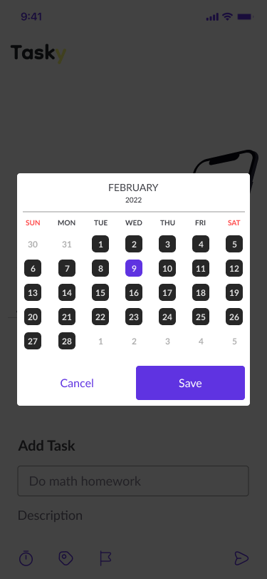
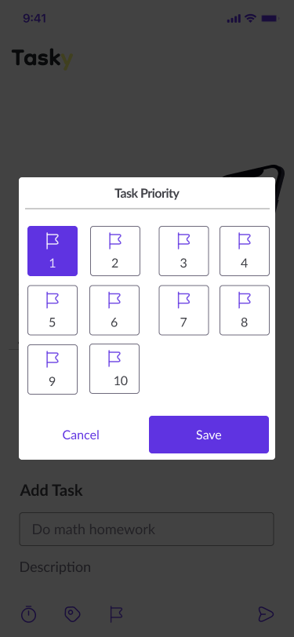
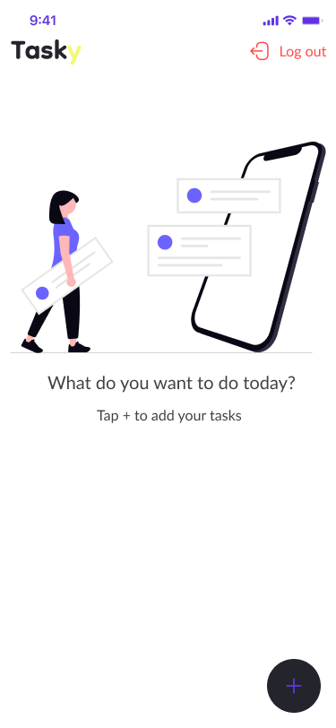
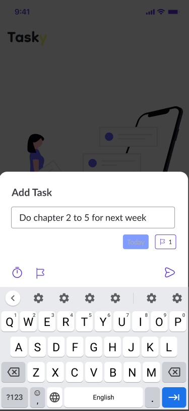
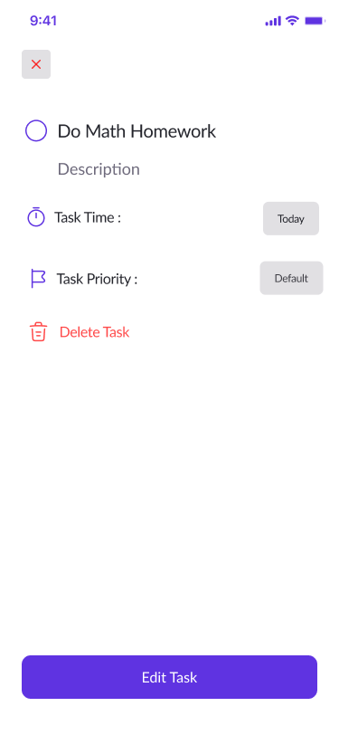
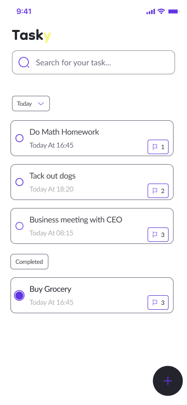

# Tasky App 📋

A modern task management mobile application built with Flutter using Clean Architecture and BLoC/Cubit state management.

## 🚀 Features

* Add new tasks
* Edit existing tasks
* Delete tasks
* Mark tasks as completed
* Search tasks
* Real-time database integration using Firebase Firestore
* Responsive and clean UI
* Scalable architecture for maintainability

---

## 🏗️ Architecture

This project follows:

* Clean Architecture
* MVVM Pattern
* SOLID Principles
* Repository Pattern
* BLoC/Cubit State Management

---

## 🛠️ Technologies Used

* Flutter
* Dart
* Firebase Firestore
* Firebase Authentication
* Bloc / Cubit
* Clean Architecture

---

## 📸 Screenshots
### Splash Screen

### Onboarding Screen1

### Onboarding Screen2
.png)
### Onboarding Screen3
.png)
### Register Screen

### Login Screen

### Choice date

### Choice Periority



### Home Screen


### Add Task Screen


### Edit Task Screen


### Search Screen


---

## 📂 Project Structure

```bash
lib/
├── core/
├── features/
├── data/
├── domain/
├── presentation/
```

---

## ⚙️ Installation

```bash
git clone https://github.com/Basmala-hub/tasky_app.git
cd tasky_app
flutter pub get
flutter run
```

---

## 🔮 Future Improvements

* Push notifications
* Task reminders
* Dark mode
* Cloud synchronization

---

## 👩‍💻 Author

Basmala Sayed Salah

* GitHub:
  https://github.com/Basmala-hub

* LinkedIn:
  https://www.linkedin.com/in/basmala-sayed462004
